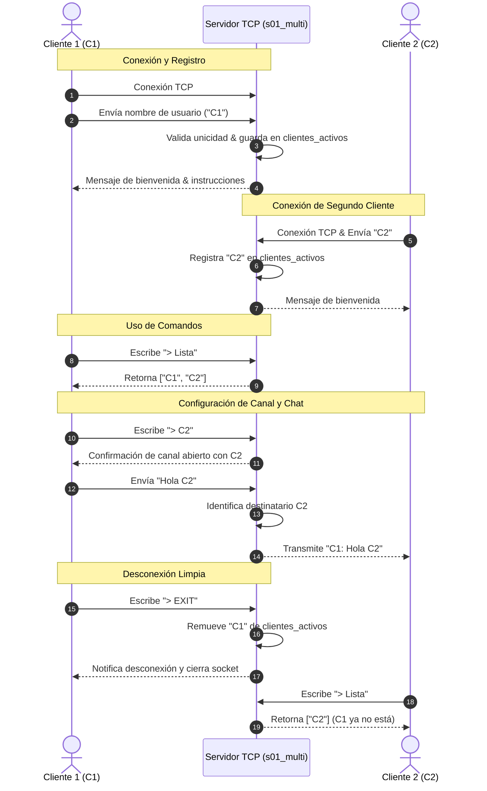

# Chat Multicliente Concurrente con Sockets TCP

Este proyecto consiste en un sistema de chat concurrente en tiempo real basado en el protocolo TCP, implementado en Python. Permite la conexión simultánea de múltiples clientes a un único servidor centralizado, facilitando la comunicación directa e individual entre los participantes mediante el direccionamiento de canales y comandos especiales.

---

## Características Principales

*   **Arquitectura Concurrente y Multihilo (Servidor)**: 
    *   Uso de la biblioteca nativa `threading` de Python.
    *   Cada nueva conexión entrante es delegada a un hilo secundario independiente, permitiendo escalar a múltiples clientes simultáneos de forma no bloqueante.
*   **Registro e Identificación Única**:
    *   El primer mensaje transmitido de forma automática por el cliente al conectar sirve como registro de identidad.
    *   El servidor valida la unicidad del nombre de usuario y lo almacena de forma segura en un diccionario global (`clientes_activos = { "nombre_usuario": socket_conexion }`) gestionado mediante exclusión mutua (`threading.Lock`).
*   **Canales y Mensajería Dinámica**:
    *   **Mensajería Bidireccional Directa**: Los clientes pueden enviarse mensajes con formato clásico en pantalla (`C1: Hola`, `C2: QUE TAL`).
    *   **Ruteo Selectivo**: Un cliente define a su destinatario usando el comando de redirección, y todos los siguientes mensajes comunes se enrutan de manera directa a ese usuario específico.
*   **Comandos Interactivos Incorporados**:
    *   `> Lista`: Solicita y despliega en tiempo real la lista de todos los usuarios actualmente conectados.
    *   `> NombreUsuario` (Ej: `> C2`): Selecciona y abre un canal de comunicación directo hacia el usuario indicado.
    *   `> END` / `> EXIT`: Provoca la desconexión ordenada del cliente, removiéndolo del diccionario del servidor y cerrando sus conexiones de red limpiamente.
*   **IU de Consola Limpia**:
    *   El hilo secundario de recepción en el cliente utiliza retornos de carro (`\r`) para sobreescribir el prompt de entrada (` -> `), evitando que las líneas se desalineen al recibir mensajes nuevos mientras el usuario escribe.

---

## Requisitos del Sistema

*   **Sistema Operativo**: Multiplataforma (Windows, Linux, macOS).
*   **Entorno de Ejecución**: Python 3.6 o superior.
*   **Dependencias**: Únicamente librerías nativas estándar de Python:
    *   `socket` (Administración de sockets TCP/IP).
    *   `threading` (Gestión de subprocesos concurrentes).
    *   `sys` y `time` (Formateo y control de tiempos).

---

## Guía de Instalación y Configuración

El proyecto no requiere la instalación de librerías de terceros (como `pip`). Solo asegúrate de tener descargados los archivos `s01_multi.py` y `c01_multi.py` en la misma máquina o en máquinas diferentes conectadas en red.

### Opción A: Pruebas Locales (Misma Computadora)
*   Usa la dirección de bucle local (`127.0.0.1`) al conectar tus clientes. El puerto por defecto es el `8089`.

### Opción B: Conexión en Red Local (Hotspot Móvil / Mismo Wi-Fi)
1.  **Servidor**: Tu compañero inicia el servidor. Debe averiguar su IP local IPv4 ejecutando:
    *   En Windows: `ipconfig` (ej: `192.168.1.50`).
    *   En Linux/Mac: `ifconfig` o `ip a`.
2.  **Cliente**: Los clientes se conectan ingresando la dirección IP local de la computadora servidor (en lugar del predeterminado `127.0.0.1`) y el puerto `8089`.

### Opción C: Conexión mediante ngrok (Por Internet / Fuera de Red Local)
1.  **Servidor**: Inicia el servidor localmente en el puerto `8089`.
2.  **Túnel de ngrok**: Ejecuta ngrok en un puerto TCP en tu terminal:
    ```bash
    ngrok tcp 8089
    ```
3.  ngrok te proporcionará una dirección de reenvío similar a: `tcp://0.tcp.ngrok.io:12345`.
4.  **Cliente**: Al ejecutar el cliente, introduce la IP/Dominio (`0.tcp.ngrok.io`) y el puerto público de ngrok (`12345`).

---

## Instrucciones de Uso

Sigue estos pasos en el orden exacto para iniciar tu sesión de chat concurrente:

### 1. Levantar el Servidor
En una terminal dentro del directorio del proyecto, ejecuta el archivo `s01_multi.py`:
```bash
python s01_multi.py
```
El servidor quedará a la escucha de nuevas conexiones en su puerto establecido.

### 2. Conectar Clientes
Abre terminales adicionales para los diferentes clientes (por ejemplo, para los usuarios `C1` y `C2`) y ejecuta en cada una:
```bash
python c01_multi.py
```
1.  Introduce la dirección IP (o presiona Enter para usar `127.0.0.1`).
2.  Introduce el puerto (o presiona Enter para usar `8089`).
3.  Escribe tu nombre de usuario único.

### 3. Flujo Exacto de Comandos
Una vez registrados, los usuarios se encuentran en modo de espera de comandos.

1.  **Ver usuarios conectados**:
    Escribe `> Lista` para verificar quiénes están activos:
    ```text
    -> > Lista
    Servidor: Usuarios conectados actualmente: ['C1', 'C2']
    ```
2.  **Establecer un canal**:
    Desde la consola del usuario `C1`, abre comunicación con `C2` escribiendo:
    ```text
    -> > C2
    Servidor: Canal con 'C2' habilitado. Los siguientes mensajes se enviarán directamente.
    ```
    *(Nota: C2 también debe definir a C1 como su destino usando `> C1` para responder de forma bidireccional)*.
3.  **Enviar Mensajes**:
    Escribe cualquier texto común y presiona Enter:
    ```text
    -> Hola, ¿cómo estás C2?
    ```
    El usuario `C2` verá en su consola:
    ```text
    C1: Hola, ¿cómo estás C2?
    ```
4.  **Desconectarse**:
    Cuando desees finalizar la comunicación, escribe:
    ```text
    -> > EXIT
    ```
    El cliente se cerrará y el servidor limpiará el registro de forma concurrente sin afectar a los demás usuarios activos.

---

## Diagrama de Flujo

A continuación se muestra el ciclo de vida de los mensajes y comandos en la arquitectura distribuida del chat:


